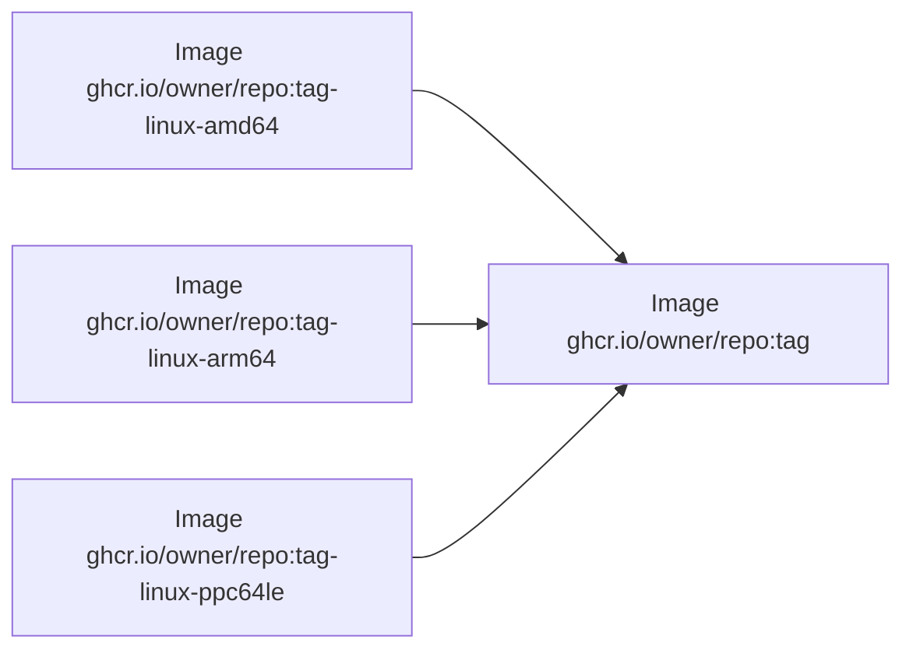
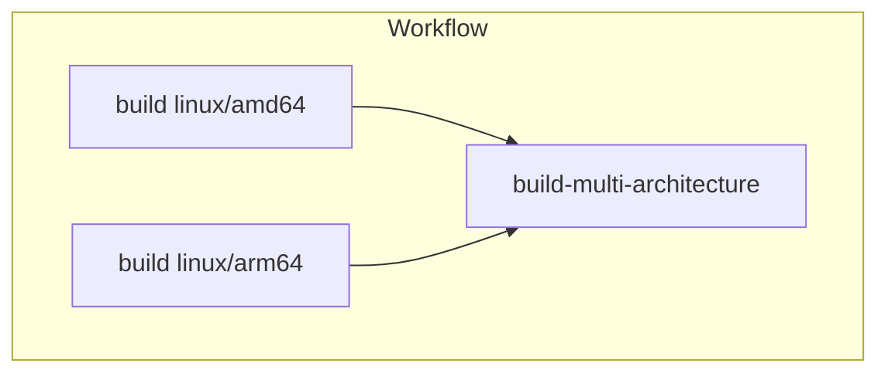

# docker-manifest-create-action [](https://github.com/int128/docker-manifest-create-action/actions/workflows/ts.yaml)

This is an action to create a multi-architecture Docker image in GitHub Actions.
It is interoperable with [docker/build-push-action](https://github.com/docker/build-push-action) and [docker/metadata-action](https://github.com/docker/metadata-action).

## Purpose

When we build a multi-architecture image using [docker/build-push-action](https://github.com/docker/build-push-action), it takes a long time to build all platforms in a single job.
It would be nice to build images in parallel and finally create a multi-architecture image from them.



We can create a multi-architecture image by the following commands:

- [`docker manifest create`](https://docs.docker.com/engine/reference/commandline/manifest_create/)
- [`docker manifest push`](https://docs.docker.com/engine/reference/commandline/manifest_push/)

This action depends on the commands.
For example, if it is called with the following inputs,

```yaml
      - uses: int128/docker-manifest-create-action@v1
        with:
          tags: ghcr.io/owner/repo:tag
          suffixes: |
            -linux-amd64
            -linux-arm64
            -linux-ppc64le
```

it executes the following commands:

```sh
# create a manifest of multi-architecture image
docker manifest create ghcr.io/owner/repo:tag \
  ghcr.io/owner/repo:tag-linux-amd64 \
  ghcr.io/owner/repo:tag-linux-arm64 \
  ghcr.io/owner/repo:tag-linux-ppc64le

# push the manifest to the remote repository
docker manifest push owner/repo:tag

# verify the manifest
docker manifest inspect owner/repo:tag
```

See also the following docs:

- [Create and push a manifest list](https://docs.docker.com/engine/reference/commandline/manifest/#create-and-push-a-manifest-list) (Docker)
- [Pushing a multi-architecture image](https://docs.aws.amazon.com/AmazonECR/latest/userguide/docker-push-multi-architecture-image.html) (Amazon ECR)

## Getting Started

Here is an example workflow to build a multi-architecture image for `amd64` and `arm64`.

```yaml
jobs:
  build:
    strategy:
      fail-fast: false
      matrix:
        platform:
          - linux/amd64
          - linux/arm64
    runs-on: ubuntu-latest
    timeout-minutes: 10
    steps:
      - uses: docker/login-action@v2
        with:
          registry: ghcr.io
          username: ${{ github.actor }}
          password: ${{ secrets.GITHUB_TOKEN }}
      - uses: docker/metadata-action@v4
        id: metadata
        with:
          images: ghcr.io/${{ github.repository }}
          # avoid overwriting the latest tag because metadata-action does not add a suffix to it
          flavor: latest=false,suffix=-${{ matrix.platform }}
      - uses: docker/setup-buildx-action@v2
      - uses: docker/build-push-action@v3
        with:
          push: true
          tags: ${{ steps.metadata.outputs.tags }}
          labels: ${{ steps.metadata.outputs.labels }}
          platforms: ${{ matrix.platform }}

  build-multi-architecture:
    needs:
      - build
    runs-on: ubuntu-latest
    timeout-minutes: 10
    steps:
      - uses: docker/login-action@v2
        with:
          registry: ghcr.io
          username: ${{ github.actor }}
          password: ${{ secrets.GITHUB_TOKEN }}
      - uses: docker/metadata-action@v4
        id: metadata
        with:
          images: ghcr.io/${{ github.repository }}
      - uses: int128/docker-manifest-create-action@v1
        with:
          tags: ${{ steps.metadata.outputs.tags }}
          suffixes: |
            -linux-amd64
            -linux-arm64
```

Here is a diagram of this workflow:



See also [the full example of e2e-test](.github/workflows/e2e.yaml) with cache options.

### For branches

When `main` branch is pushed, `build` job creates the following images by default of [docker/metadata-action](https://github.com/docker/metadata-action):

- `ghcr.io/owner/repo:main-linux-amd64`
- `ghcr.io/owner/repo:main-linux-arm64`

Then, `build-multi-architecture` job creates the following image:

- `ghcr.io/owner/repo:main`

### For tags

When `v1.0.0` tag is pushed, `build` job creates the following images by default of [docker/metadata-action](https://github.com/docker/metadata-action):

- `ghcr.io/owner/repo:v1.0.0-linux-amd64`
- `ghcr.io/owner/repo:v1.0.0-linux-arm64`

Because docker/metadata-action does not add a suffix to `latest` tag,
it needs to set `latest=false` to avoid overwriting `latest` tag for each build.

Finally, `build-multi-architecture` job creates the following images:

- `ghcr.io/owner/repo:v1.0.0`
- `ghcr.io/owner/repo:latest`

If `latest` tag is given, this action pushes it from the non-latest tag.

## Native build on self-hosted runners

If you are using the self-hosted runners, you can build an image faster.
For example, you can natively build an `arm64` image on AWS Graviton 2.

Here is an example workflow.

```yaml
jobs:
  build:
    strategy:
      fail-fast: false
      matrix:
        platform:
          - amd64
          - arm64
    runs-on:
      - self-hosted
      - ubuntu-${{ matrix.platform }}
    permissions:
      id-token: write
      contents: read
    steps:
      - uses: aws-actions/configure-aws-credentials@v1
        with:
          role-to-assume: arn:aws:iam::ACCOUNT:role/ROLE
      - uses: aws-actions/amazon-ecr-login@v1
        id: ecr
      - uses: docker/metadata-action@v4
        id: metadata
        with:
          images: ${{ steps.ecr.outputs.registry }}/${{ github.repository }}
          flavor: suffix=-${{ matrix.platform }}
      - uses: docker/build-push-action@v3
        with:
          push: true
          tags: ${{ steps.metadata.outputs.tags }}
          labels: ${{ steps.metadata.outputs.labels }}

  build-multi-architecture:
    needs:
      - build
    runs-on: ubuntu-latest
    permissions:
      id-token: write
      contents: read
    steps:
      - uses: aws-actions/configure-aws-credentials@v1
        with:
          role-to-assume: arn:aws:iam::ACCOUNT:role/ROLE
      - uses: aws-actions/amazon-ecr-login@v1
        id: ecr
      - uses: docker/metadata-action@v4
        id: metadata
        with:
          images: ${{ steps.ecr.outputs.registry }}/${{ github.repository }}
      - uses: int128/docker-manifest-create-action@v1
        with:
          tags: ${{ steps.metadata.outputs.tags }}
          suffixes: |
            -amd64
            -arm64
```

## Specification

### Inputs

| Name | Default | Description
|------|----------|------------
| `tags` | (required) | tags of destination images (multi-line string)
| `suffixes` | (required) | suffixes of source images (multi-line string)

### Outputs

Nothing.

### Behavior

This action runs the following commands for each tag.

```sh
docker manifest create {tag} {tag}{suffix}...
docker manifest push {tag}
docker manifest inspect {tag}
```
