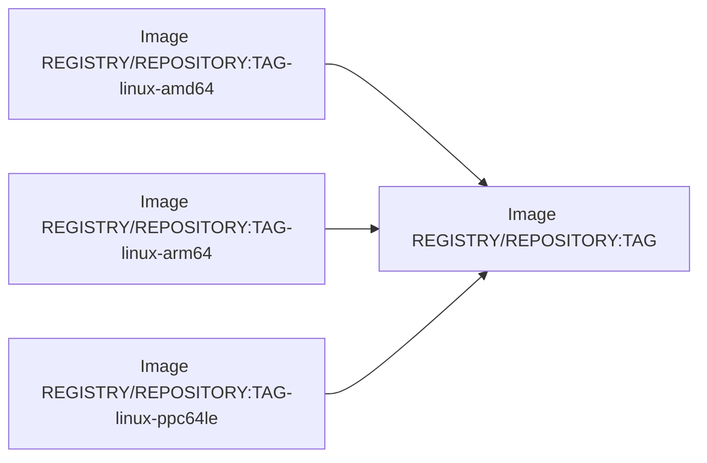
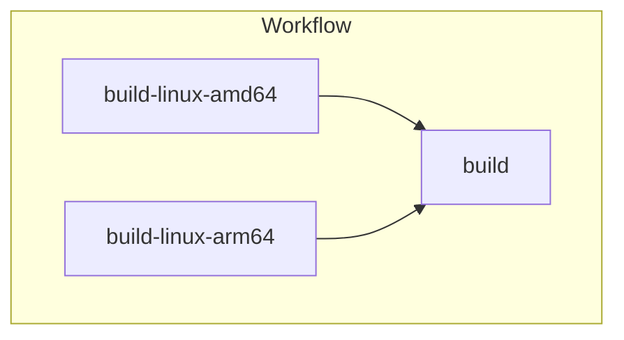

# docker-manifest-create-action [](https://github.com/int128/docker-manifest-create-action/actions/workflows/ts.yaml)

This is an action to create a multi-architectures container image in GitHub Actions.
It is interoperable with [docker/metadata-action](https://github.com/docker/metadata-action).

## Migration from V1 to V2

This action no longer supports the `suffixes` input.
You need to set an image URI with a digest or tag.
If you use docker/build-push-action, you can construct an image URI from the outputs as follows:

```yaml
- uses: docker/build-push-action@v5
  id: build-amd64
  with: # ...omit...
- uses: docker/build-push-action@v5
  id: build-arm64
  with: # ...omit...

- uses: int128/docker-manifest-create-action@v2
  with:
    tags: ghcr.io/${{ github.repository }}:main
    sources: |
      ghcr.io/${{ github.repository }}@${{ steps.build-amd64.outputs.digest }}
      ghcr.io/${{ github.repository }}@${{ steps.build-arm64.outputs.digest }}
```

## Getting Started

When we build a multi-architectures image using [docker/build-push-action](https://github.com/docker/build-push-action), it takes a long time to build all platforms in a single job.
It would be nice to build images in parallel and finally create a multi-architectures image from them.



We can create a multi-architectures image by the below commands.

```sh
# push a manifest of multi-architecture image
docker buildx imagetools create -t REGISTRY/REPOSITORY:TAG \
  REGISTRY/REPOSITORY:TAG-linux-amd64 \
  REGISTRY/REPOSITORY:TAG-linux-arm64 \
  REGISTRY/REPOSITORY:TAG-linux-ppc64le

# verify the manifest
docker buildx imagetools inspect REGISTRY/REPOSITORY:TAG
```

This action runs the above commands for each tag.

```yaml
- uses: int128/docker-manifest-create-action@v2
  with:
    tags: |
      REGISTRY/REPOSITORY:TAG
    sources: |
      REGISTRY/REPOSITORY:TAG-linux-amd64
      REGISTRY/REPOSITORY:TAG-linux-arm64
      REGISTRY/REPOSITORY:TAG-linux-ppc64le
```

See also the following docs:

- [`docker buildx imagetools create`](https://docs.docker.com/engine/reference/commandline/buildx_imagetools_create/)
- [Create and push a manifest list](https://docs.docker.com/engine/reference/commandline/manifest/#create-and-push-a-manifest-list) (Docker)
- [Pushing a multi-architecture image](https://docs.aws.amazon.com/AmazonECR/latest/userguide/docker-push-multi-architecture-image.html) (Amazon ECR)

## Examples

### Basic usage

Here is an example workflow to build a multi-architectures image for `linux/amd64` and `linux/arm64`.

```yaml
jobs:
  build-linux-amd64:
    uses: ./.github/workflows/reusable--docker-build.yaml
    with:
      images: ghcr.io/${{ github.repository }}
      platforms: linux/amd64

  build-linux-arm64:
    uses: ./.github/workflows/reusable--docker-build.yaml
    with:
      images: ghcr.io/${{ github.repository }}
      platforms: linux/arm64

  build:
    needs:
      - build-linux-amd64
      - build-linux-arm64
    runs-on: ubuntu-latest
    timeout-minutes: 10
    outputs:
      image-uri: ghcr.io/${{ github.repository }}@${{ steps.build.outputs.digest }}
    steps:
      - uses: docker/login-action@v3
        with:
          registry: ghcr.io
          username: ${{ github.actor }}
          password: ${{ secrets.GITHUB_TOKEN }}
      - uses: docker/metadata-action@v5
        id: metadata
        with:
          images: ghcr.io/${{ github.repository }}
      - uses: int128/docker-manifest-create-action@v2
        id: build
        with:
          index-annotations: ${{ steps.metadata.outputs.labels }}
          tags: ${{ steps.metadata.outputs.tags }}
          sources: |
            ghcr.io/${{ github.repository }}@${{ needs.build-linux-amd64.outputs.digest }}
            ghcr.io/${{ github.repository }}@${{ needs.build-linux-arm64.outputs.digest }}
```

Here is the diagram of this workflow.



For details, see the following workflows:

- [`.github/workflows/e2e-docker.yaml`](.github/workflows/e2e-docker.yaml)
- [`.github/workflows/reusable--docker-build.yaml`](.github/workflows/reusable--docker-build.yaml)
- [`.github/workflows/e2e-kaniko.yaml`](.github/workflows/e2e-kaniko.yaml)

### Native build on the self-hosted runners

If you are using the self-hosted runners, you can build an image faster.
For example, you can natively build an `arm64` image on AWS Graviton 2.

Here is an example workflow.

```yaml
jobs:
  build-linux-amd64:
    uses: ./.github/workflows/reusable--docker-build.yaml
    with:
      runs-on: self-hosted-amd64

  build-linux-arm64:
    uses: ./.github/workflows/reusable--docker-build.yaml
    with:
      runs-on: self-hosted-arm64

  build:
    needs:
      - build-linux-amd64
      - build-linux-arm64
    runs-on: ubuntu-latest
    timeout-minutes: 10
    permissions:
      contents: read
      id-token: write
    outputs:
      image-uri: ${{ steps.ecr.outputs.registry }}/${{ github.repository }}@${{ steps.build.outputs.digest }}
    steps:
      - uses: aws-actions/configure-aws-credentials@v3
        with:
          role-to-assume: arn:aws:iam::ACCOUNT:role/ROLE
      - uses: aws-actions/amazon-ecr-login@v3
        id: ecr
      - uses: docker/metadata-action@v5
        id: metadata
        with:
          images: ${{ steps.ecr.outputs.registry }}/${{ github.repository }}
      - uses: int128/docker-manifest-create-action@v2
        id: build
        with:
          index-annotations: ${{ steps.metadata.outputs.labels }}
          tags: ${{ steps.metadata.outputs.tags }}
          sources: |
            ${{ steps.ecr.outputs.registry }}/${{ github.repository }}@${{ needs.build-linux-amd64.outputs.digest }}
            ${{ steps.ecr.outputs.registry }}/${{ github.repository }}@${{ needs.build-linux-arm64.outputs.digest }}
```

## Specification

This action requires Docker Buildx.

### Inputs

| Name                | Default                      | Description                                            |
| ------------------- | ---------------------------- | ------------------------------------------------------ |
| `push`              | `true`                       | Push the manifest to the registry                      |
| `index-annotations` | -                            | Add annotations to the image index (multi-line string) |
| `tags`              | (required if `push` is true) | Tags of the destination images (multi-line string)     |
| `sources`           | (required)                   | Image URIs of the sources (multi-line string)          |

If `push` is false, this action runs `docker buildx imagetools create --dry-run`.

If `index-annotations` is set, this action adds `--annotation`.
See https://docs.docker.com/engine/reference/commandline/buildx_imagetools_create/#annotation for details.

### Outputs

| Name     | Description                    |
| -------- | ------------------------------ |
| `digest` | Digest of the created manifest |
